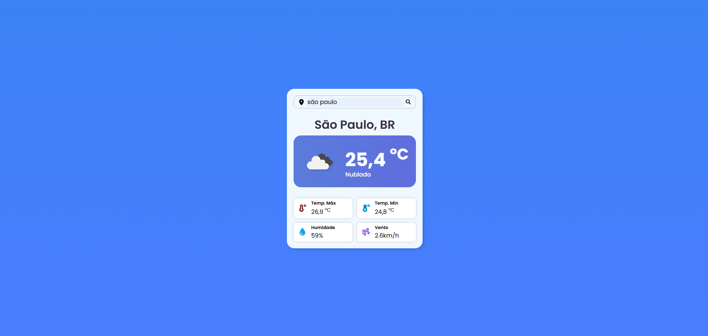

# Weather App

A simple weather application built with HTML, CSS and JavaScript.  
It uses the OpenWeather API to fetch and display real-time weather information based on the city searched by the user.

## Preview



## Features

- Search weather by city name  
- Displays current temperature in °C  
- Shows weather description (clear, rain, clouds, etc.)  
- Displays minimum and maximum temperature  
- Shows humidity and wind speed  
- Error handling for invalid cities  
- Dynamic UI updates without page reload  

## Technologies Used

- HTML5  
- CSS3  
- JavaScript (Vanilla JS)  
- OpenWeather API  
- Font Awesome  

## How it works

The application listens for the form submit event and prevents page reload using `event.preventDefault()`.

It then:
- Captures the city name from the input
- Sends a request to the OpenWeather API
- Processes the JSON response
- Updates the DOM with weather information

If the city is not found, an error message is displayed with a 404 illustration.

## API Integration

This project uses the OpenWeather API:

```js id="api1"
https://api.openweathermap.org/data/2.5/weather?q={city}&appid={API_KEY}&units=metric&lang=pt_br
